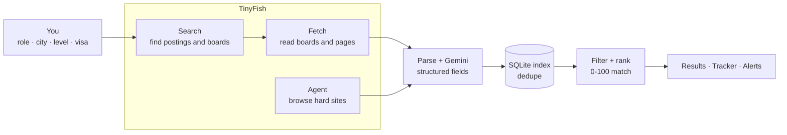

<div align="center">

# Scout

### Find the role, not the portal.

A live job and internship finder. Scout reads real company careers pages and job portals in real time with **TinyFish Search, Fetch and Agent**, removes duplicates, understands pay, visa and seniority, and ranks every opening against what you actually want.


[Product overview](docs/PRODUCT_OVERVIEW.md) · [Quick start](#quick-start) · [How it works](#how-it-works) · [Configuration](#configuration) · [API](#api)

</div>

---

## Why Scout

Job hunting means opening the same careers pages every week, re-typing the same filters, and losing track of what you already saw. Aggregators help, but they show stale listings, hide pay and visa details, and repeat the same job three times.

Scout does that weekly loop for you, with live data:

- **You say what you want once:** role, city, seniority, work mode, pay floor, visa needs, keywords, even your resume.
- **Scout goes and reads the live web:** ATS job boards, company careers pages and portals, including Indian ones like Internshala, Naukri, Instahyre and Cutshort.
- **You get a short, ranked, honest list:** each opening has a 0–100 match score, the reasons behind it, structured pay and visa signals, and a direct apply link.
- **It keeps working after you close the tab:** saved searches re-run on a schedule and notify you when something new matches.

## Features

| | |
|---|---|
| **Live discovery** | TinyFish Search finds postings and company boards across 12 selectable sources; TinyFish Fetch reads them in a real browser; TinyFish Agent browses sites that need a human-like visit. |
| **Smart matching** | Role matching understands that "Front End Developer" is "Frontend Engineer", filters by seniority, location, work mode, job type, pay, visa and keywords, and scores what remains. |
| **Structured fields** | Seniority, years of experience, work mode, employment type, pay (₹ LPA, crore and monthly stipends understood), visa stance (sponsors / no sponsorship / work authorization), skills, freshness. |
| **AI reading** *(optional)* | Gemini 3.5 Flash-Lite reads each relevant posting and fixes what regexes miss: clean title, company, pay, visa, required vs nice-to-have skills, a 25-word summary, junk-page detection. |
| **No dead ends** | Zero results never means a blank page: you get "Almost matched" openings (one filter off), one-click "relax this filter" buttons and example searches. |
| **Fast and bounded** | Results stream in within seconds. Every search has a time budget (40 / 75 / 150 s) and slow work finishes in the background. |
| **Application tracker** | Save jobs, drag them between Saved, Applied, Interview, Offer and Rejected, add notes, and get warned when a listing closes. |
| **Company watchlist** | Track employers by name or careers link; Scout reads their board straight away and in every search. |
| **Alerts** | Save a search as an alert. A scheduler re-runs it and notifies you through an in-app bell, desktop notifications and optional Telegram. |
| **Resume skill gap** | Paste your resume to see which skills a posting asks for that you already have, and which you are missing. |
| **Built for India** | ₹ pay formats, Indian city aliases (Bengaluru/Bangalore, Gurugram/Delhi NCR), Indian portals, internship stipends. |
| **Export** | One-click CSV of your results. |

## How it works



1. **Search** runs one query per source group (ATS boards, startup boards, Indian portals, the open web) for your role and a synonym.
2. **Fetch** reads what Search found: it expands a company's whole job board from a single hit, opens Indian category pages and harvests their postings, and deep-reads individual postings.
3. **Agent** browses only where a browser is truly needed, such as a custom careers site Fetch cannot read.
4. **Parse + AI** turn messy text into structured fields. Regexes are the baseline; Gemini fills the gaps.
5. **Dedupe + rank** merge the same job from different portals, apply your hard filters, then score the rest.

The full story, with the exact TinyFish parameters, throttling and failure handling, is in the **[Product overview](docs/PRODUCT_OVERVIEW.md)**.

## Quick start

**Requirements:** Node.js 22.13 or newer, and a [TinyFish API key](https://docs.tinyfish.ai/authentication).

```bash
git clone <your-repo-url> scout
cd scout
npm install
cp .env.example .env        # then add your TINYFISH_API_KEY
npm run dev                 # http://localhost:3000
```

Open the app, enter a role and a city, and press **Search live**. First results appear within seconds; the search finishes inside its time budget.

> **Tip:** if a stale `TINYFISH_API_KEY` is set in your system environment, don't worry. The key in `.env` always wins.

### Production

```bash
npm run build
npm start
```

Scout stores its data in a local SQLite file (`data/scout.db`), so run it on a machine with a persistent disk. The alert scheduler only runs while the server is running.

## Deploying

Scout is a normal Next.js app, but it keeps its data in a **local SQLite file** and runs a background alert scheduler, which suits a server with a disk better than a serverless platform.

| Host | What to expect |
|---|---|
| **Your machine, a VPS, Railway, Render or Fly.io (with a volume)** | Everything works, including persistent data and scheduled alerts. Recommended. |
| **Vercel / serverless** | The app runs, with caveats below. |

**On Vercel**
- Set `TINYFISH_API_KEY` (and optionally `GEMINI_API_KEY`) under *Project → Settings → Environment Variables*, set the Node.js version to **22.x**, then redeploy. A `.env` file is not deployed.
- **Storage is temporary.** The project folder is read-only, so Scout uses the temp directory. Saved jobs, the tracker, alerts and the search cache can disappear when an instance is recycled or when a request lands on a different instance. The app shows a notice when this is the case.
- **No scheduler.** Serverless functions can't run a background timer, so scheduled alerts don't fire. (The *Send a demo alert* button still works.)
- **Long searches** stream for up to the depth's time budget (40 / 75 / 150 s). Make sure your plan's function duration allows it, or use Quick depth.
- Slow background work (a TinyFish Agent run) may be cut off once the response ends.

For persistent data on Vercel, the storage layer would need to move to a hosted database such as Turso (libSQL) or Postgres; see the roadmap.

## Configuration

All configuration is through environment variables in `.env`. Keys never reach the browser.

| Variable | Required | Purpose |
|---|---|---|
| `TINYFISH_API_KEY` | **Yes** | TinyFish Search, Fetch and Agent. |
| `GEMINI_API_KEY` | No | Turns on AI reading of postings. Needs a Google AI Studio key with billing credits. |
| `GEMINI_MODEL` | No | Defaults to `gemini-3.5-flash-lite`. |
| `TELEGRAM_BOT_TOKEN`, `TELEGRAM_CHAT_ID` | No | Also push alerts to Telegram. |
| `PORT` | No | Dev server port (default `3000`). |
| `SCOUT_DB` | No | Database file path (default `data/scout.db`). |

If a key is missing or rejected, the app says so in plain language (top bar and toasts) and degrades gracefully: no Gemini key means regex-only extraction, and nothing else changes.

## Search depth

| Depth | Roles searched | Boards expanded | Postings read | AI reads | Time budget |
|---|---|---|---|---|---|
| Quick | 1 (+ synonym) | 5 | 15 | 15 | 40 s |
| Standard | 2 (+ synonyms) | 12 | 40 | 40 | 75 s |
| Deep | 3 (+ synonyms) | 25 | 90 | 90 | 150 s |

A search always returns by its budget. Anything slower, like a TinyFish Agent run on a hard-to-read site, keeps going in the background and updates your results when it finishes.

## Project structure

```
app/                     Next.js App Router
  api/*/route.js           HTTP API (search streams NDJSON progress)
  page.js, layout.js       Entry point, fonts, metadata
  globals.css              Design tokens and all styles
components/              React UI
  ScoutProvider.js         App state, streaming search, notification polling
  Shell, Prefs, Results    Discover screen (search card, run bar, result rows)
  Drawer, Description      Job detail and the description reader
  Tracker, Companies,      Tracker board, company watchlist,
  Alerts, Bell             alerts and the notification centre
  Select, Fields           Accessible dropdown and form controls
lib/                     Server and shared logic (no framework code)
  tinyfish.js              TinyFish Search / Fetch / Agent client + throttling
  discover.js              The discovery pipeline (the heart of Scout)
  parse.js                 Feature engineering: seniority, pay, visa, skills...
  rank.js                  Role matching, hard filters, scoring, dedupe
  llm.js                   Gemini extraction, validation and merge rules
  describe.js              Turns scraped text into facts, headings, lists
  db.js, service.js        SQLite access and shared use cases
  notify.js                Notifications and optional Telegram push
instrumentation.js       Starts the alert scheduler when the server boots
docs/PRODUCT_OVERVIEW.md Product story and TinyFish deep dive
test*.js                 Offline test suites (no network, no keys)
```

## API

Everything the UI does is available over HTTP. `search` and `companies/scan` stream newline-delimited JSON events (`stage`, `progress`, `batch`, `results`, `done`, `error`).

| Method | Route | Purpose |
|---|---|---|
| `GET` | `/api/status` | Whether keys are configured (never the keys), usage, AI state, background work |
| `GET` `PUT` | `/api/profile` | Saved preferences and resume |
| `POST` | `/api/rank` | Rank the stored index against preferences (instant, no network) |
| `POST` | `/api/search` | Run a live search; streams progress and ranked snapshots |
| `GET` `POST` | `/api/tracker` | Saved and applied jobs |
| `GET` `POST` `PATCH` `DELETE` | `/api/searches` | Saved-search alerts |
| `GET` `POST` `DELETE` | `/api/companies` | Company watchlist |
| `GET` | `/api/companies/:id/jobs` | Indexed openings for one company |
| `POST` | `/api/companies/scan` | Scan one company (streams progress) |
| `POST` | `/api/verify` | Re-check whether a listing is still open |
| `GET` `POST` | `/api/notifications` | Notification centre |
| `POST` | `/api/notifications/demo` | Fire a demo alert through the real notification path |

## Tests

```bash
npm test
```

Three offline suites cover parsing and feature extraction, ranking and every filter, deduplication, Indian pay formats, the Gemini request/validation/merge path (against a local stand-in server), and the description reader (against real Internshala, Lever and Cutshort samples). They need no network and no API keys.

## Security and privacy

- API keys live in `.env` and are read on the server only. The browser is told whether a key is configured, never its value.
- `.env`, the local database and build output are git-ignored. `.env.example` contains no secrets.
- Your preferences, resume, tracker and alerts are stored in a local SQLite file. Nothing is sent anywhere except the searches and page reads you trigger (to TinyFish) and, if enabled, posting text (to Gemini).
- Scout reads publicly available pages. Always confirm details on the employer's own site before applying.

## Known limitations

- Extraction without a Gemini key relies on heuristics: pay, visa and level are strong hints, not guarantees.
- Location matching is text-based with country and Indian-city aliases ("California" will not match "San Francisco, CA").
- Foreign pay is converted to ₹ at fixed approximate rates (marked with `≈`) for comparison and display only.
- Some sites put a cookie wall or bot check in front of automated readers. Scout reports this instead of hiding it, and the Agent may or may not get through.
- The alert scheduler runs inside the server process, so alerts only fire while Scout is running.
- Telegram delivery is implemented but needs your own bot to try.

## Roadmap

- Hosted database adapter (Turso / Postgres) so Scout can run on Vercel with permanent data
- Hosted worker so alerts fire when your laptop is closed
- Email and WhatsApp delivery
- Semantic matching with embeddings ("ML engineer" ≈ "applied scientist")
- AI-written cover notes and resume bullets per job, using the skill-gap analysis
- Ghost-job detection (old, repeatedly reposted, no real apply path)
- Browser extension for one-click save from any careers page

## License

[MIT](LICENSE). Built for the TinyFish *Job Portal / Careers Finder* challenge.
