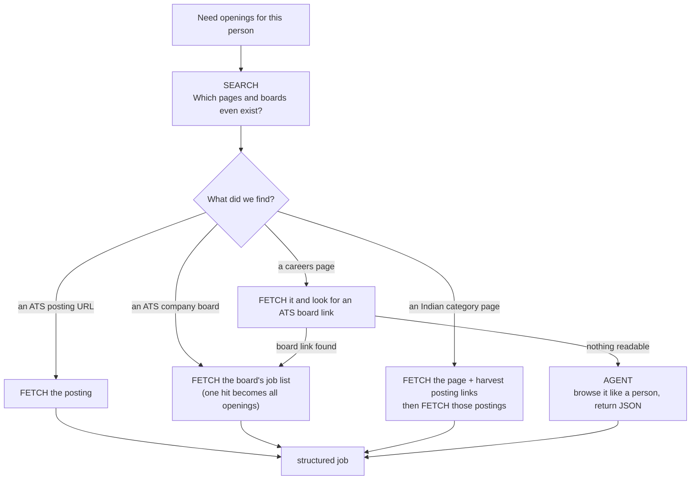

# Scout: Product Overview

> **Find the role, not the portal.**
> Scout is a live job and internship finder that reads real careers pages and job boards with TinyFish, and ranks every opening against what you actually want.

This document explains what Scout is, who it is for, how a search works end to end, and, in detail, **how TinyFish Search, Fetch and Agent are each used and why**.

**Contents**
1. [The problem](#1-the-problem)
2. [The product](#2-the-product)
3. [A search, end to end](#3-a-search-end-to-end)
4. [How TinyFish is used](#4-how-tinyfish-is-used) (Search · Fetch · Agent · why this split)
5. [From messy pages to ranked results](#5-from-messy-pages-to-ranked-results)
6. [AI reading with Gemini](#6-ai-reading-with-gemini)
7. [Staying fresh: tracker, watchlist and alerts](#7-staying-fresh-tracker-watchlist-and-alerts)
8. [Built to be fast and to fail gracefully](#8-built-to-be-fast-and-to-fail-gracefully)
9. [Data, security and privacy](#9-data-security-and-privacy)
10. [Honest limits and what's next](#10-honest-limits-and-whats-next)
11. [Challenge requirements, mapped](#11-challenge-requirements-mapped)

---

## 1. The problem

Anyone looking for a job or internship ends up doing the same weekly ritual: open a dozen careers pages and portals, re-apply the same filters, scan for anything new, and try to remember what they have already seen. The existing tools each fail in a predictable way:

| Pain | What it looks like |
|---|---|
| **Stale and duplicated listings** | The same role appears on three portals, and some of them closed weeks ago. |
| **Hidden details** | Pay, visa sponsorship and real seniority are buried in paragraphs of text. |
| **Dead-end searches** | A strict search returns "0 results" with no hint of what to change. |
| **No memory** | Nothing tells you when a new matching opening appears, and nothing tracks where each application stands. |
| **Generic ranking** | Results are ordered by recency or by who paid for placement, not by fit. |

The data is all public. What is missing is something that **reads the live web on your behalf**, understands what it reads, and tells you only what matters. That is what TinyFish makes possible and what Scout is built around.

## 2. The product

Scout is a local web app (Next.js + SQLite). You describe what you want once; Scout does the weekly loop for you.

### Who it is for
- **Students and fresher candidates** hunting for internships and entry-level roles, especially in India, where the best listings live on portals like Internshala, Naukri, Instahyre and Cutshort rather than on company sites.
- **Experienced candidates** who care about specific employers, pay floors, remote work or visa sponsorship.
- **Anyone who is on careers portals every week** and wants to stop.

### What you do
1. **Describe the job:** role, city, level, work mode, job type, pay floor, visa needs, keywords, and optionally paste your resume.
2. **Press Search live.** The first results appear within seconds and keep improving while Scout reads more of the web.
3. **Read a ranked, honest list.** Each row shows a 0–100 match score, why it matched, pay, work mode, visa stance, skills and a direct **Apply** link. A drawer shows the full description in a clean, readable form.
4. **Act:** save to the tracker, hide what you don't want, add companies to a watchlist, or save the search as an alert.
5. **Walk away.** Alerts re-run on a schedule and notify you when new openings match.

### What makes it different
- **Live, not indexed.** Scout reads pages when you ask, with a real browser behind TinyFish, so it sees what the employer shows today.
- **It explains itself.** Every score has reasons; every hidden job has a counted, plain-language cause ("151 other locations, 71 other roles").
- **It never dead-ends.** Zero results turns into near misses, one-click filter relaxation and example searches.
- **It is built for the Indian market** as a first-class case: ₹ LPA, crore and monthly stipends, Indian city aliases, Indian portals.

## 3. A search, end to end

```mermaid
sequenceDiagram
  autonumber
  participant You
  participant Scout
  participant Search as TinyFish Search
  participant Fetch as TinyFish Fetch
  participant Agent as TinyFish Agent
  participant AI as Gemini (optional)
  You->>Scout: role · city · level · visa · "Search live"
  Scout-->>You: instant: ranked results already in your index
  Scout->>Search: 1 query per source group (ATS · boards · India · web)
  Search-->>Scout: ranked hits (postings, company boards, category pages)
  par company boards
    Scout->>Fetch: board job list for each company found
    Fetch-->>Scout: all openings at that company
  and individual postings
    Scout->>Fetch: read postings and category pages (small parallel chunks)
    Fetch-->>Scout: page text as markdown + links
  and hard sites (background)
    Scout->>Agent: browse the careers page, return structured jobs
  end
  Scout->>AI: relevant postings stream in as they arrive
  AI-->>Scout: clean fields, summary, skills, junk check
  Scout-->>You: streamed ranked snapshots, then a final result
  Note over Scout,You: always returns within the time budget;<br/>slow Agent work finishes in the background
```

A few details worth noting:

- **You see something immediately.** Before any network call, Scout ranks what is already in your local index, so the screen is never empty on a repeat visit.
- **Results stream.** Each batch of newly parsed openings is ranked and sent to the browser (throttled to one snapshot per 1.5 s). If you have scrolled down, Scout shows a "↑ N new matches" pill instead of reshuffling the list under you.
- **The run is bounded.** Quick, Standard and Deep searches have time budgets of 40, 75 and 150 seconds. At the deadline Scout returns what it has; unfinished tasks keep running in the background and the page refreshes itself when they land.

## 4. How TinyFish is used

Scout uses all three TinyFish capabilities, each for the job it is best at, and in a deliberate order from **cheapest and fastest to most capable**:



### 4.1 Search: *discover what exists*

**What it is:** a ranked web search API (`GET api.search.tinyfish.ai`).

**What Scout asks it:** "which job postings, company job boards and portal pages match this person?" Scout does not hardcode companies or listings. Everything starts from a live query.

How Scout uses it:

| Aspect | How |
|---|---|
| **One query per source group, not per portal** | Search accepts many domains at once via `include_domains`, so Scout sends a single query for the whole ATS group (Greenhouse, Lever, Ashby, Workable, SmartRecruiters, Workday), one for startup boards (Work at a Startup, Wellfound, Built In, remote boards), one for Indian portals (Naukri, Internshala, Instahyre, Cutshort, foundit, Hirist) and one open-web query ("careers apply"). This cut a typical search from 28 queries to 6. |
| **Role + synonym** | Each role is searched with its best synonym ("UI/UX" also searches "product designer"; "Frontend Developer" also "UI engineer"). "Intern" is added when you ask for internships. |
| **Freshness** | "Posted within N days" is passed as `recency_minutes`. |
| **Region** | Indian locations add the Indian portal group and set `location=IN`. |
| **Intent** | A `purpose` string tells Search it is looking for individual postings and careers pages, not articles. |
| **Rate limits** | Throttled to one request every 2.1 s (the documented 30 requests per minute). |
| **Caching** | Identical queries are cached locally for 6 hours, so repeat searches and scheduled alerts skip the network. |

**What Scout does with the hits** (`classify`):

| Hit looks like | Becomes |
|---|---|
| A single ATS posting (e.g. a Greenhouse job URL) | A posting to read, **and** its company board to expand |
| An ATS company board (no job id) | A board to expand |
| An Indian portal posting (`/internship/detail/…`, `naukri.com/job-listings-…`) | A posting to read |
| An Indian category page (`internshala.com/internships/…`, a Naukri `…-jobs` page) | A page to open and harvest |
| Any other careers-like URL | A posting to read |

### 4.2 Fetch: *read what Search found*

**What it is:** a page reader (`POST api.fetch.tinyfish.ai`) that renders URLs in a real browser and returns clean markdown, title, links and dates. Up to 10 URLs per request.

Fetch does most of the work in Scout, in four distinct ways:

**① Board expansion: one hit becomes every opening at a company.**
Search often surfaces one posting at a company. Scout recognises the ATS and Fetches that company's public job-list endpoint (Greenhouse, Lever, Ashby and SmartRecruiters are supported). One hit turns into the full opening list: Databricks alone yielded 888 listings from one read. Scout then prefilters by title relevance (so it never reads hundreds of irrelevant pages), keeps up to 25 per board (60 for an explicit company scan), and deep-reads only the promising ones.

> **A real-world detail:** Fetch returns markdown, and markdown backslash-escapes punctuation, so `absolute_url` arrives as `absolute\_url` and breaks `JSON.parse`. Scout un-escapes the text before parsing, so the board read genuinely goes through TinyFish.

**② Posting deep-read.**
Postings are read for their text, from which Scout extracts location, pay, visa wording, years of experience, skills and a posted date. Reads happen in **small parallel chunks of 3** with a 20 s per-URL timeout, so one slow page cannot stall the rest.

**③ Indian category pages → postings.**
A page like "87 Front End Internships" on Internshala is not a job, it is a list of jobs. Scout Fetches the page with `links: true`, picks the links that match posting patterns (`/internship/detail/`, `/job-listings-`, `/job-<id>`, `/job/`), and reads up to 8 of them. Titles like "Front End Development Internship in Delhi at EkoSight Technologies" are parsed for company and city.

**④ Careers-page link following and freshness checks.**
For a company on your watchlist, Fetch reads its careers page and looks for a link to an ATS board; if found, the board is read directly. Saved and applied jobs are re-checked with `ttl: 0` (a live read) to catch closed listings.

| Aspect | How |
|---|---|
| **Throttling** | Charged per URL at 420 ms (the documented 150 URLs per minute), so a single-URL board read costs 0.4 s, not a whole batch's worth. |
| **Timeouts** | `per_url_timeout_ms` of 20–30 s so a slow page fails fast. |
| **Caching** | `ttl: 3600` for pages and `600` for board lists; `ttl: 0` for liveness checks. |
| **Skipping known pages** | URLs already in the index with a current-parser description are not re-read. |
| **Failure** | Per-URL errors are collected, never fatal. A bad key or no credits stops the run with a clear message. |

### 4.3 Agent: *browse like a person, only when needed*

**What it is:** a natural-language web agent (`POST agent.tinyfish.ai/v1/automation/run-async`, polled at `/v1/runs/{id}`) that operates a real browser toward a goal and returns structured JSON.

Agent runs are the slowest and the only credit-consuming call, so Scout treats them as a **fallback**, not a default:

| Aspect | How |
|---|---|
| **When** | Only for **watchlist companies with custom careers sites** that are not on a known ATS, and only **after Fetch has tried first**: Fetch reads the page, looks for an ATS link, and looks for 3+ posting links. The Agent runs only if none of those work. |
| **The goal** | A plain-English instruction built from your preferences: *"Find currently open job postings on this careers page relevant to {roles} in or near {locations}. Use the page's search or filters if available and check up to 3 pages of results. For each job return title, location, the absolute URL to apply, department, posted date and employment type."* |
| **Structured output** | An `output_schema` forces a `{ jobs: [{ title, location, url, department, posted_date, employment_type }] }` result, so there is no scraping of the agent's prose. |
| **Browser profile** | `stealth`, because careers pages are often behind bot checks. |
| **Never blocks a normal search** | In a regular search the Agent runs in the background. Scout does not wait for it; when it finishes its jobs land in the index and the page refreshes ("Slower sites finished reading in the background"). |
| **Waits only when you asked** | The explicit "Scan now" on a company waits up to 300 s with live progress. |
| **Not used for low-value pages** | Blocked individual search hits are dropped, not sent to an Agent: the reliability cost was not worth it. |
| **Honest when it fails** | If a site walls off even the Agent (one real example: a cookie wall that returned 136 characters of "cookies are disabled"), the company row says so instead of showing a hollow "0 openings". |

### 4.4 Why this split

| Capability | Strength | Cost / speed | Scout uses it for |
|---|---|---|---|
| **Search** | Discovery across the whole web in one call | Free tier, ~1–3 s | Finding which pages and boards exist |
| **Fetch** | Reads a known URL in a real browser; batchable | Free tier, ~1–20 s | Almost everything: boards, postings, category pages |
| **Agent** | Operates a site with clicks, filters, pagination | Credits, ~15–150 s | Only the sites the others cannot read |

> TinyFish documents Search and Fetch as free up to daily allowances (at the time of writing: Search 12,000 requests per day, Fetch 1,000 URLs per day) with credits used by Agent and Browser. This is why Scout is structured to do the heavy lifting with Search and Fetch and reserve the Agent.

This ordering is also what makes Scout fast: board expansion and posting reads run **concurrently** with the remaining searches, so the first results appear within seconds rather than after the slowest page.

## 5. From messy pages to ranked results

### 5.1 Feature engineering (`lib/parse.js`)

Every posting becomes a structured record:

| Field | How it is derived |
|---|---|
| **Seniority** | Title keywords first (intern, junior, senior, staff, "Engineer 2"), then years of experience, otherwise "level not stated" (never guessed silently). |
| **Work mode** | remote / hybrid / on-site from the title, location and the text ("work from home" included). |
| **Employment type** | full-time, internship (incl. co-op), contract, part-time. |
| **Pay** | Ranges in ₹, $, £, €: `₹6–10 LPA`, `INR 12,00,000 – 18,00,000`, `$120–160k`, hourly and monthly. Internship stipends are kept per month. Everything is annualised for comparison. |
| **Visa** | `sponsors`, `no sponsorship`, `work authorization required`, or `unknown`, plus an OPT/CPT flag. |
| **Skills** | ~100 skills with aliases (`js`→javascript, `k8s`→kubernetes). |
| **Years of experience** | Parsed from phrases like "3+ years of experience". |
| **Role family** | design, software, data, ML, product, sales and more, used as a weak hint. |
| **Freshness** | Posted date, decayed with a 21-day half-life. |

### 5.2 Hard filters, then a score

Jobs first pass **hard filters**; everything that fails is counted by reason and shown to you in plain language.

| Filter | Rule |
|---|---|
| **Role** | Title relevance ≥ 0.5. "Front End Developer" ≡ "Frontend Engineer"; synonym groups; a *field* word must match (a "Flight Software Engineer" is not a "Frontend Developer"). Whole-word only: "UX" never matches "Linux". |
| **Location** | City and country aliases. If you choose **remote**, the posting must *say* remote, and "Remote – US" does not satisfy "Delhi". |
| **Seniority / type** | Your chosen levels and job types. |
| **Pay floor** | Applies to listed pay (converted to ₹); does **not** apply to internship stipends. Jobs without pay stay visible unless you choose "Only jobs that list pay". |
| **Keywords** | "Must mention one" (default) or "Boost ranking only". |
| **Must / exclude / visa / posted within** | As you set them. |

The survivors are scored 0–100 from weighted components, normalised over the components that apply to your search:

| Component | Weight |
|---|---|
| Title / role relevance | 35 |
| Location and work mode | 15 |
| Seniority | 15 |
| Keywords | 12 |
| Visa (when you need sponsorship) | 10 |
| Skill overlap with your resume | 10 |
| Freshness | 8 |
| Pay vs your floor | 5 |

The drawer shows the per-component breakdown and the plain-language reasons.

### 5.3 Deduplication

The same job on Greenhouse and on an aggregator becomes **one** row:
- an exact fingerprint of normalised company + title + city;
- a fuzzy merge for near-identical titles at the same company and place;
- the **employer's own ATS link wins** as the Apply link, with other sources listed.

### 5.4 Never a dead end

When strict filters remove everything, Scout shows **"Almost matched"** (the right role, one filter off, labelled with which one), buttons like "**Any location · +24**" showing how many openings each relaxation unlocks, a "Search deeper" option, and example searches for a first visit.

### 5.5 A description you can actually read

Scraped text differs on every site, so `lib/describe.js` normalises it into a **facts strip** (start date, pay, experience, apply-by, openings, applicants), clean headings, lists, skill chips and inline bold/links, with boilerplate ("Actively hiring", "Learn Figma" upsells) removed and long text clamped.

## 6. AI reading with Gemini

Optional, and designed to degrade gracefully. With a `GEMINI_API_KEY`, relevant postings are read by **`gemini-3.5-flash-lite`**.

| Aspect | Detail |
|---|---|
| **What it extracts** | Clean title, company, locations, work mode, employment type, seniority, years, pay (full currency units, ₹ aware), visa stance, required vs nice-to-have skills, a 25-word summary, an optional apply-by date, and an `is_job_posting` check that removes listing pages and "position closed" pages. |
| **Why a model, not more regexes** | Negation ("we do **not** sponsor visas"), messy pay wording and unstated companies are exactly what regexes get wrong. |
| **Streaming** | Postings are queued as they are parsed and read 4 at a time **while Fetch is still running**, so AI adds almost no wall-clock time. |
| **Cost-aware** | Only postings that would be shown to you (or fail only because something is unstated) are read, capped at 15 / 40 / 90 per run, once each (cached). At $0.30 / 1M input and $2.50 / 1M output tokens that is roughly $0.001 per posting. |
| **Never trusted blindly** | Every field is validated and coerced in code; wrong enums, implausible pay and bad JSON are dropped. The model never overwrites a title-based seniority or a real company name. |
| **Fails safely** | A rejected key, exhausted credits or rate limit never fails a search. AI reading pauses for 10 minutes, the top bar says why, and everything else keeps working. |

## 7. Staying fresh: tracker, watchlist and alerts

- **Tracker.** A drag-and-drop board (Saved → Applied → Interview → Offer → Rejected) with quick "Mark applied →" buttons, notes, undo on remove, and a "Listing closed" flag. Saved and applied links are re-checked daily with a live Fetch.
- **Company watchlist.** Add a company by name or careers link. Scout resolves its careers page with Search, detects an ATS board through Fetch, reads its openings immediately, and includes it in every search. The row shows live progress, a clear success or failure message, and an expandable list of what was found.
- **Alerts.** Save a search as an alert (every 3–24 hours). A scheduler checks every 10 minutes for due alerts, re-runs them, keeps only openings **first seen since the last run**, and creates a notification delivered to the in-app bell, as a desktop notification, and optionally on Telegram. A **Send a demo alert** button fires the exact same code path using real openings from your index.

## 8. Built to be fast and to fail gracefully

| Principle | How |
|---|---|
| **Results in seconds** | Stored results are shown instantly; new ones stream in batches; the first ranked results typically appear in 4–12 seconds. |
| **Always bounded** | Per-depth time budgets; unfinished work moves to the background instead of making you wait. |
| **Fewer round trips** | Source-group queries, a 6-hour search cache, skipping already-indexed pages, and board expansion that turns one hit into many. |
| **No slow-page stalls** | Parallel chunks and per-URL timeouts. |
| **Honest errors** | Missing key, rejected key, no credits, rate limit and no connection each get a plain message with what to do. Partial failures are counted and shown, never hidden. |
| **Self-healing data** | The parser is versioned: when extraction improves, stored jobs parsed by an older version are re-read and replaced in place, keeping their tracker links. |

## 9. Data, security and privacy

- **Keys stay on the server.** `TINYFISH_API_KEY`, `GEMINI_API_KEY` and Telegram credentials are read from `.env` server-side; `/api/status` reports only whether a key exists. There is no key-entry field in the browser.
- **Local storage.** One SQLite file holds `jobs`, `tracker`, `searches`, `companies`, `notifications` and a small `kv` cache (profile, search cache). Nothing leaves your machine except searches and page reads sent to TinyFish and, if enabled, posting text sent to Gemini.
- **Public data only.** Scout reads publicly available pages. It collects no credentials and does not submit applications.
- **Repo hygiene.** `.env`, the database and build output are git-ignored; `.env.example` has no secrets.

## 10. Honest limits and what's next

**Limits**
- Without Gemini, pay, visa and level come from heuristics: strong hints, not guarantees. With Gemini they are better but still worth a glance at the source.
- Location matching is text-based with aliases, not geocoding.
- Foreign pay is converted at fixed approximate rates for comparison and display.
- Sites with a cookie wall or bot check may defeat both Fetch and the Agent; Scout reports this.
- The alert scheduler lives in the server process, so alerts only fire while Scout runs.
- Quick searches read a bounded number of pages by design; Standard and Deep read more.

**Next**
Hosted alerts worker · email and WhatsApp delivery · embedding-based semantic matching · AI-written cover notes and resume bullets from the skill-gap analysis · ghost-job detection · a browser extension for one-click save.

## 11. Challenge requirements, mapped

Built for the TinyFish **Job Portal / Careers Finder** challenge.

| Requirement | Where Scout meets it |
|---|---|
| **Working demo** | `npm run dev` runs the full product locally. |
| **User sets their own preferences (role, location, keywords)** | Search card plus "More filters": roles, locations, work mode, level, job type, keywords, must-have/exclude, visa, pay, posted-within, sources, depth, resume. Saved automatically. |
| **Pulls openings from multiple live careers pages or job portals** | 12 selectable sources: Greenhouse, Lever, Ashby, Workable, SmartRecruiters, Workday, Work at a Startup, Wellfound, Built In, remote boards, Indian portals (Naukri, Internshala, Instahyre, Cutshort, foundit, Hirist) and the open web, plus any company you add. |
| **Structured, deduplicated listings with apply links** | Structured fields per opening, cross-portal dedupe, the employer's own link preferred, CSV export. |
| **Short explanation of how Search, Fetch and Agent are used** | [Section 4](#4-how-tinyfish-is-used). |
| **Uses TinyFish meaningfully to discover and read listings** | Search discovers, Fetch reads (boards, postings, category pages, careers pages), Agent handles sites that need a browser. |
| **Live web data, not hardcoded listings** | There are no bundled listings. Every opening comes from a live query. |
| **Works across companies, portals, roles, locations and inputs** | Verified live on engineering, design and analyst roles across Indian and international sources. |
| **Filters, matches and ranks rather than dumping raw pages** | Hard filters with counted reasons, a 0–100 weighted score with explanations, near-miss recovery. |
